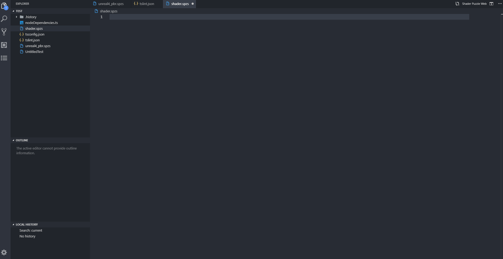
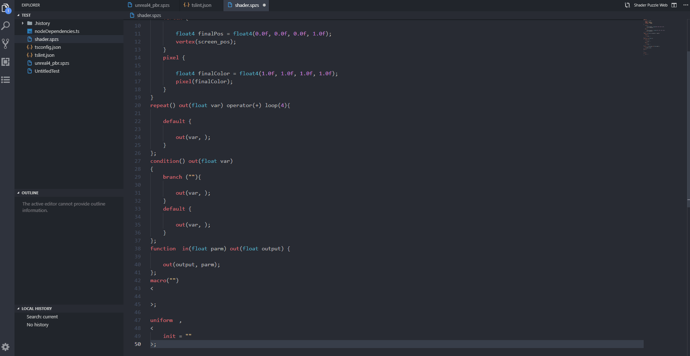
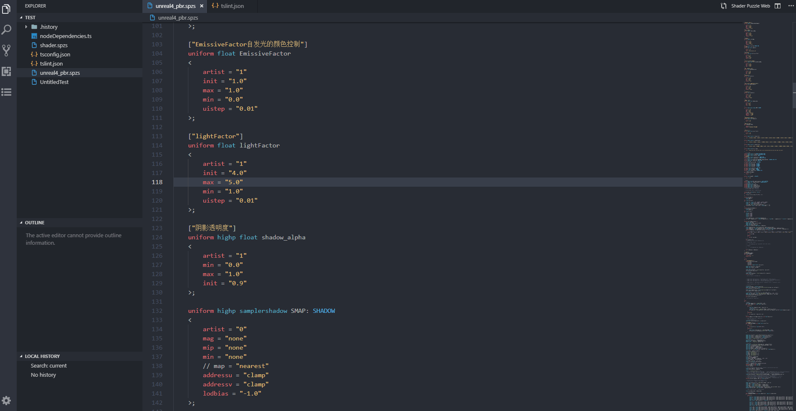
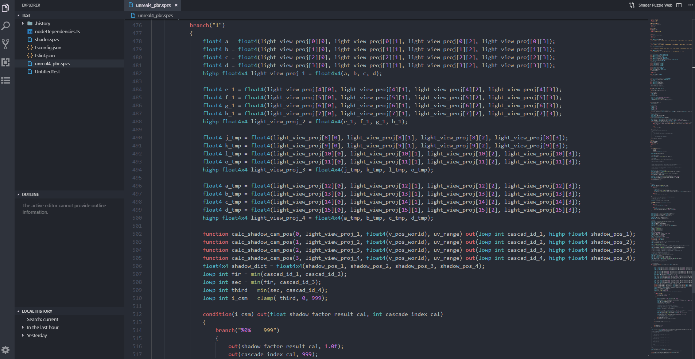

# Shader Puzzle Helper

## Description
This is your extension "ShaderPuzzleHelper" capable of highlighting, code snippet, function tip, global proporties search, find definition of words.
Increasing productivity of writing shade puzzle.

## Features
Describe specific features of this extension. 

### Code HighLighting

### Code Snippets

### Function Tips

### Global Proporties

### Find Definition

> Tip: Press [Ctrl] to check the definition of the word whom cursor point to.

## Requirements

### Install Extension
    -- first ...
    -- second ...

### Compile Source Code
    -- Install *Visual Studio Code*
    -- Install Node.js
    -- Download Source Code
    -- Run *npm install* with command-line in directory of source code file.
    -- Open *Visual Studio Code* in directory of source code file.
    -- Press *F5* to run

## Known Issues

Calling out known issues can help limit users opening duplicate issues against your extension.

## Credits

* [Visual Studio Code](https://code.visualstudio.com/)
* [vscode-docs on GitHub](https://github.com/Microsoft/vscode-docs)
* [VS Code Extension Samples](https://github.com/microsoft/vscode-extension-samples)

## Requirements

Visual Studio Code v1.17.0

**Enjoy!**
